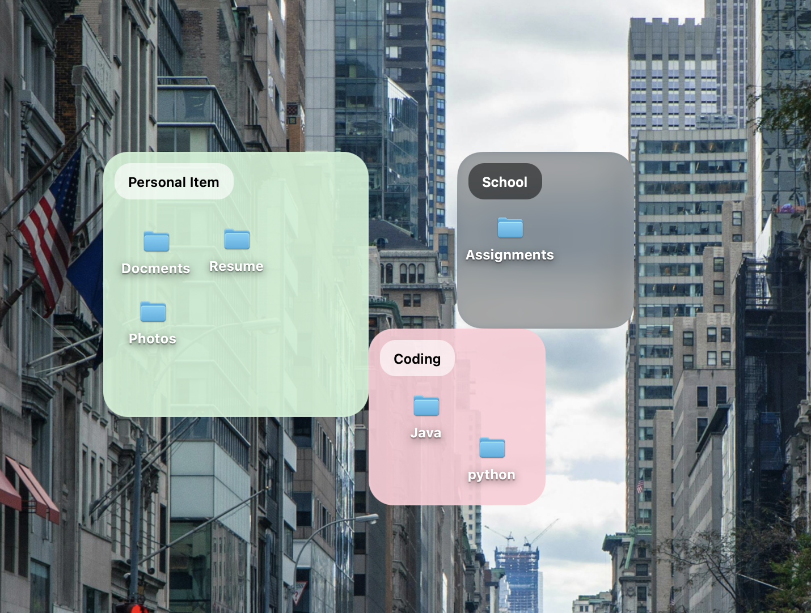

# Frame It

Frame It is a macOS menu bar app for creating desktop frames that visually group files, folders, and shortcuts.

## Features

- Create new frames by drawing directly on the desktop
- Move and resize frames while edit mode is enabled
- Rename frames from the title or the right-click menu
- Use `Frame Only`, `Clear`, 5 pastel colors, or a custom image as the background
- Show color swatches directly in the background picker
- Fill image backgrounds edge-to-edge within the frame
- Keep frames visible across Spaces
- Save frame layout and background settings between launches
